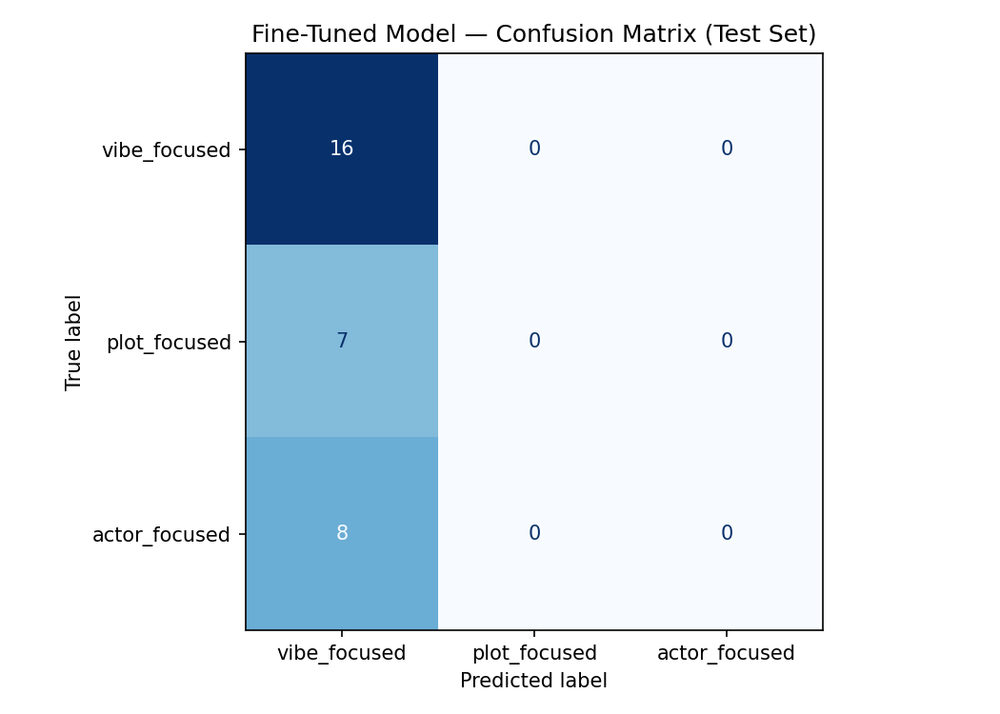

# TakeMeter: Letterboxd Review Sorter

A natural language processing pipeline that categorizes Letterboxd movie reviews into user-intent buckets—**`actor_focused`**, **`plot_focused`**, and **`vibe_focused`**—benchmarking a zero-shot LLM baseline against a fine-tuned `distilbert-base-uncased` classifier.
## Project Overview & Motivation

Letterboxd reviews range from one-line jokes to long-form cinematic dissections. Browsing community reviews often creates friction when users have distinct, mutually exclusive intents:
Checking whether an ensemble cast or lead actor delivered a standout performance without reading narrative recaps.
Evaluating screenwriting, story pacing, structural coherence, or adaptation fidelity without exposing themselves to unwanted spoilers.
Gauging the visual style, music, theater energy, or overall tone to decide if a film matches their evening plans.
TakeMeter solves this by routing unstructured community reviews into three explicit semantic classes, enabling intent-filtered review aggregation.

## Dataset Construction & Labeling

The dataset (Dataset_Letterboxed.csv) consists of 203 human-annotated Letterboxd reviews collected across four theatrical releases: Resident Evil (2026), Primetime (2026), Practical Magic 2 (2026), and The End of Oak Street (2026).

|Label|Examples|Percentage|Target / Threshold|Status|
|---|---|---|---|---|
|vibe_focused|106|52.2%|< 70%|Balanced|
|actor_focused|49|24.1%|≥ 20%|Balanced|
|plot_focused|48|23.6%|≥ 20%|Balanced |
|Total|203|100.0%|≥ 200 examples|Validated |

## Category Definitions

actor_focused: Actor focused will be focused on performances and the chemistry of actors on screen and how they take the script and make it their own

plot_focused:Plot focused will be about how they felt the plot flow how stereotypical or groundbreaking the movie is as a whole

vibe_focused: vibes focused will be the less obvious and more conceptual ratings that are about the vibe of the movie the atmosphere this will also include the reviews that are just saying whether the movie was good or otherwise, as that plays into the feel of the movie

Tie-Breaking Rule: When a post touches multiple dimensions, label assignment follows dominant semantic weight. Vague narrative mentions ("good story") subordinated to visual praise default to vibe_focused; character survival actions within the story scenario default to plot_focused.

## Experimental Setup & Modeling Pipeline

The corpus was partitioned using a 70% / 15% / 15% stratified split (random_state=42), producing a hold-out test set of 31 examples (16 vibe_focused, 8 actor_focused, 7 plot_focused).

Models Evaluated
 - Zero-Shot Baseline: Llama-3 evaluated via the Groq Cloud API using a prompt providing task definitions, label constraints, and single-label extraction.
 - Fine-Tuned Model: distilbert-base-uncased initialized with a custom 3-class sequence classification head.   

Training Hyperparameters
 - Batch Size: 16 (train and eval)
 - Warmup Ratio: 0.1 with linear decay
 - Weight Decay: 0.01
 - Epochs: 6
 - Optimization Objective: Cross-Entropy Loss evaluated on the validation split
Iterative Checkpoint Selection:
 - Run 1 (metric_for_best_model="f1"): Selected the best evaluation checkpoint based on validation Macro F1 to balance precision and recall across classes.
 - Run 2 (metric_for_best_model="balanced_accuracy"): Switched checkpoint selection to Balanced Accuracy to explicitly penalize the model when minority classes (plot_focused, actor_focused) suffered from zero-recall collapse.

## Evaluation & Results Comparison

### Results Comparison 
|Model|Accuracy| fine-tuning regression|
|---|---|---|
|Zero-shot baseline (Groq)|0.710|~|
|Fine-tuned DistilBERT run 1|0.484|0.226|
|Fine-tuned DistilBERT run 2|                 0.516|0.194|

Run 1

Run 2

## Sample Classifications
| Post (truncated) | True label | Predicted | Confidence | Correct? |
|---|---|---|---|---|
| Wait there’s lesbians in this? | vibe_focused | vibe_focused | 0.72 | yes |
| witches n shit fell asleep when the bad guy showed up and the guy from foundation was ther... | vibe_focused | vibe_focused | 0.62 | yes |
| Cool cool, just in time for the beginning of the spooky season | vibe_focused | vibe_focused | 0.69 | yes |
| This review may contain spoilers. First time watching a movie sat on a chair that moves an... | plot_focused | vibe_focused | 0.50 | no |
| Resident Evil is undoubtedly one of the best horror movies of the year; it introduces a pr... | actor_focused | vibe_focused | 0.41 | no |

The model correctly classifies 'Cool cool, just in time for the beginning of the spooky season' with a confidence of 0.69 as vibe_focused because it recognizes that 'spooky season' references seasonal/horror mood rather than plot details or acting craft."

## Error Analysis & Surfaced Failure Modes
1. Metric Optimization Impact (F1 vs. Balanced Accuracy)
Switching the evaluation checkpoint selection from Macro F1 to Balanced Accuracy altered how the model handled borderline predictions, but did not resolve representation collapse:
    - Run 1 (Macro F1 Selection): Encouraged slight class differentiation, yielding 1 true positive in actor_focused (F1: 0.18), but lower overall accuracy (48.4%) due to borderline false predictions.
    - Run 2 (Balanced Accuracy Selection): When faced with noisy boundaries on a small training corpus (~142 examples), the model converged on majority-class collapse, predicting vibe_focused across all test instances and producing an accuracy of 51.6% alongside 0.00 recall for both minority classes.   
    - Core Insight: Adjusting the checkpoint evaluation metric alone cannot overcome data starvation when the underlying embedding space has not separated informal domain vocabulary.
2. Affective Slang Overriding Semantic Subjects
Letterboxd reviewers frequently express plot and performance critique using emotional slang or profanity. DistilBERT's self-attention heads attended heavily to high-arousal valence tokens rather than the syntactic subject of the sentence:
 - Case 1: "the main character was a fucking dumbass"
    - Ground Truth: actor_focused | Predicted: vibe_focused (Confidence: 0.34)   
    - Diagnostic: Because phrases like "fucking dumbass" appear across casual reaction comments, the model clustered this with visceral reaction posts rather than recognizing "main character" as a performance critique.
3. Screenwriting Lexicon vs. Lay Discourse
Case 2: "Strong first two acts, rushed ending."
    - Ground Truth: plot_focused | Predicted: vibe_focused (Confidence: 0.35)   
    - Diagnostic: Even when reviews contained explicit structural terminology ("acts", "ending"), the brief, evaluative phrasing ("Strong", "rushed") was treated as general sentiment. The model failed to learn narrative syntax from small-scale supervision.
Case 3: "Im one of those people who believes Id survive this movie"
    - Ground Truth: plot_focused | Predicted: vibe_focused (Confidence: 0.36)   
    - Diagnostic: The review comments on horror scenario stakes and survival plausibility. However, because the text is framed as a personal joke ("believes Id survive"), the model classified it as a personality reaction rather than an evaluation of story logic.
4. Why the Zero-Shot LLM Won (71.0% vs. 48.4% / 51.6%)
The zero-shot LLM baseline succeeded because of broad world knowledge and conversational context awareness. It easily distinguished actor names, recognized colloquial character critiques ("divas"), and parsed narrative concepts (such as ending resolution and spoiler disclaimers) without task-specific fine-tuning.

## Edge Case Decisions
Documented boundary disputes from Dataset_Letterboxed.csv:
- Character Agency vs. Acting Execution:
  - Text: "he may be a dumbass, but he was my dumbass"
  - Resolution: Labeled plot_focused. The comment critiques the character's narrative survival decisions within the zombie outbreak rather than the actor's technical acting delivery.
- Atmosphere vs. Secondary Actor Mention:
  - Text: "Good balance of funny moments and jumpscares. I really like how the director incorporated POV shots to evoke the feeling of playing a video game Austin Abrams is a star! The ending damn near made me cry"
  - Resolution: Labeled vibe_focused. Although Austin Abrams is praised, the core evaluative focus centers on camera POV framing, jumpscares, and sensory immersion.
- Star Attraction Driving Plot Genre:
  - Text: "Sandra Bullock and a love story will always have a chokehold on me it’s so serious"
  - Resolution: Labeled actor_focused. While "love story" references genre, the review's primary claim centers on Sandra Bullock's star appeal.
## AI Tool Usage Reflection
- Dataset Structuring & Synthesis: LLMs were used to automate PDF review parsing and structure preliminary candidate labels across 203 rows.
- Error Pattern Discovery: An LLM was prompted to cluster the misclassified test examples by theme, which surfaced two main patterns: (1) heavy asymmetric confusion where plot_focused and actor_focused consistently collapsed into vibe_focused, and (2) high-arousal profanity/slang overriding narrative subjects.
- Metric Exploration & Hypothesis Testing:
 - Hypothesis: Switching the optimization checkpoint target from Macro F1 to Balanced Accuracy would prevent the model from collapsing into majority-class predictions.
 - Outcome: The experiment disproved the hypothesis; while Balanced Accuracy altered checkpoint selection thresholds, the fine-tuned representation remained constrained by vocabulary ambiguity and sample size.
 - Discarded Finding: An initial automated assumption suggested that short review character length was the primary failure driver. Manual re-reading disproved this, as multi-sentence reviews over 100 words suffered identical misclassification rates when affective tone obscured narrative structure.